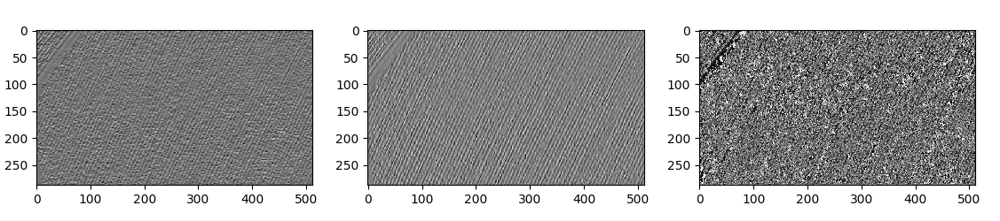
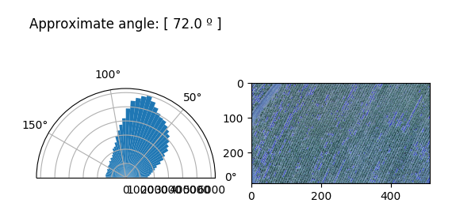

Meu primeiro detector de ângulos em imagens de drône de plantação usando conceito simples de filtros sobel
_____________________________________________________________________
# Detecção de angulos
Ao invés de fazer logo de início um detector de linhas e angulos deferentes em uma unica imagem, resolvi me exercitar e elaborar o mais MANUALMENTE possível, um detector para o ÂNGULO MAIS PREDOMINANTE em uma imagem com base nos principios do filtro sobel.

Na agricultura de precisão/digital análises como esta são cruciais para demarcar regiões e linhas para realização de outros procedimentos. Em geral a foto de um drone é extremamente grande, tornando inviável, dependendo do computador, um algorítmo que á analise por inteiro, principalmente se se tratar de uma rede neural (que pretendo implementar futuramente). Por tais motivos é interessante o desmembramento desta imagem em imagens mmenores, em pequenas regiões. partindo daí decidi elaborar este simples algoritmo.

# O Filtro sobel e inclinação
Numa pesquisa rápida vemos que estes dois filtros simples, ao serem convoluídos com a imagem detectam curvar diferenciais que representam gradientes de alteração de estado do pixel. Tendo as diferenciais horizontal e vertical, podemos por pitágoras, obter a inclinação de uma linha da imagem.

# Código
Existem dois parametros basicos já preenchidos: Amostra, que define a quantidade de amostras usadas para analisar a frequencia dos angulos (amostras muito grandes resultam em intervalos muito pequenos deficultando a análise de frequencia, e muito baixos impede a análise de encontrar angulo com precisão); 
Caminho da imagem, onde deverá ser passado o caminho da imagem a ser analisada.

Os filtros foram definidos manualmente para forçar-me a entender os conceitos basicos de convolução e processamento de imagens com filtros.

Usando scipy realizei a convolução da imagem cinza com os filtros, um por vez:

A pŕimeira imagem é do filtro sobel horizontal e a segunda, do vertical, aplicados á imagem. A terceira imagem trata do processamento entre elas duas.

# Processamento do gradiente
Para calcular o angulo usamos pitágoras, onde sin/cos = tan. se a intensidade horizontal H e a vertical V representam sin e cos respectivamente, então podemos dizer que, naquele local, o angulo é repesentado por Θ = arctan(H/V), e como arctan em +∞ e -∞ tende á pi/2, então Θ = arctan(H/V)*2/pi.
Após vários teste percebi que calculando o angulo ponto a ponto, estamos calculando cegamente, o que nos deixa num mar de ruído. a solução que eu encontrei por enquanto foi, não calcular para um pixel, mas para a média entre este pixel e todos os outro ao redor dele, desta forma estaremos enchergando melhor. è o que esta sendo mostrado na terceira imagem.

plotando um histograma em forma polar e usando algebra básica obteos o seguinte:

