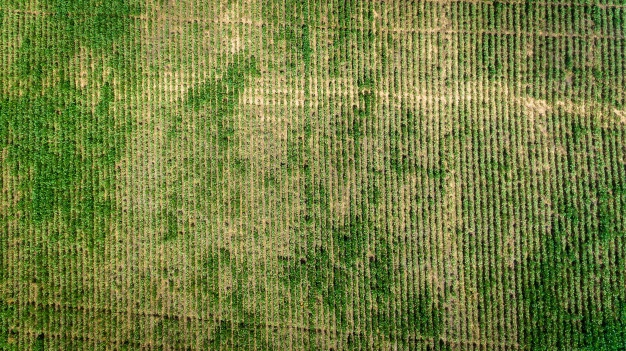
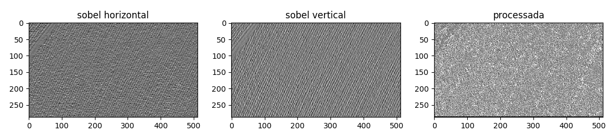
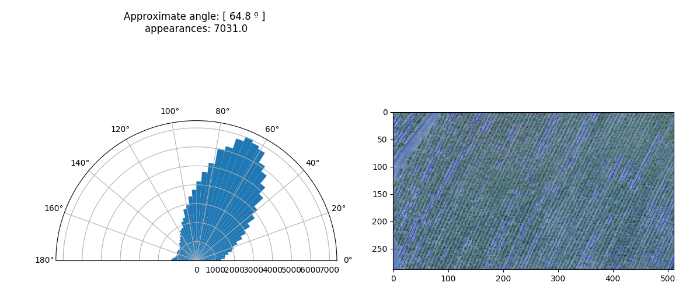
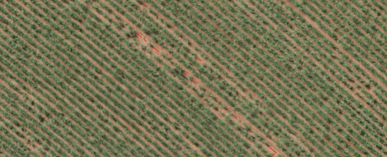
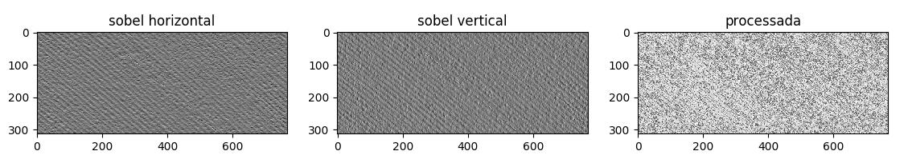
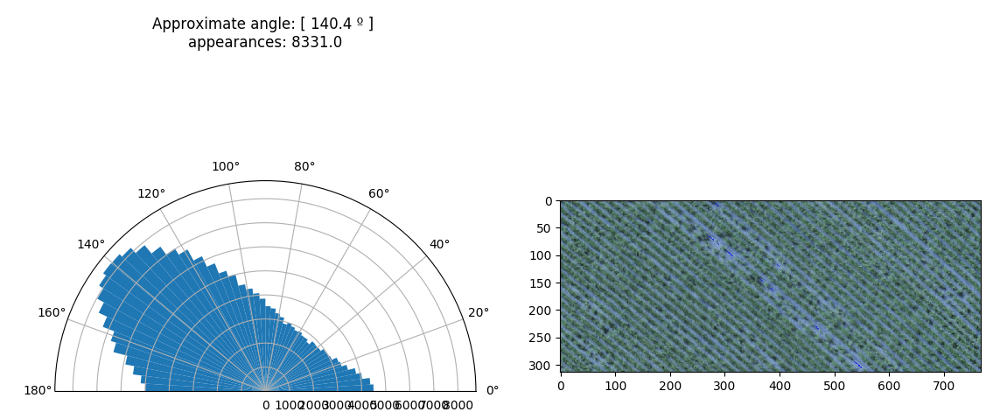
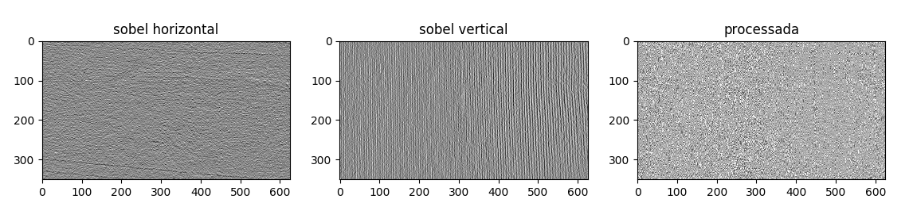
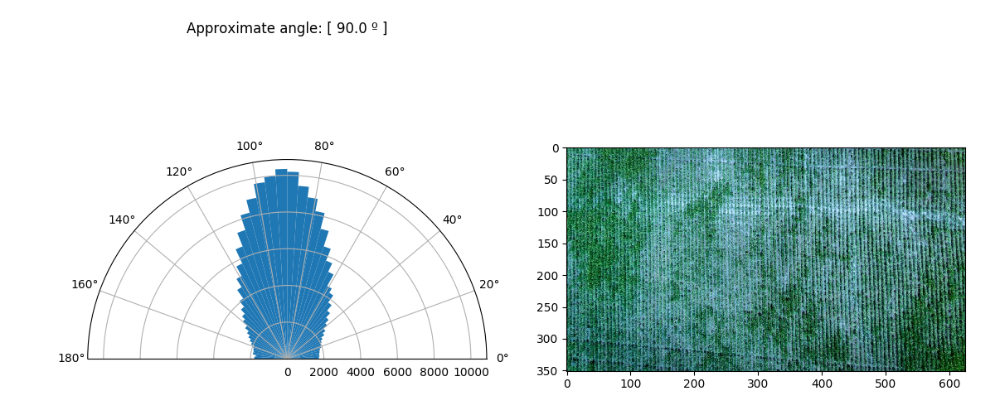
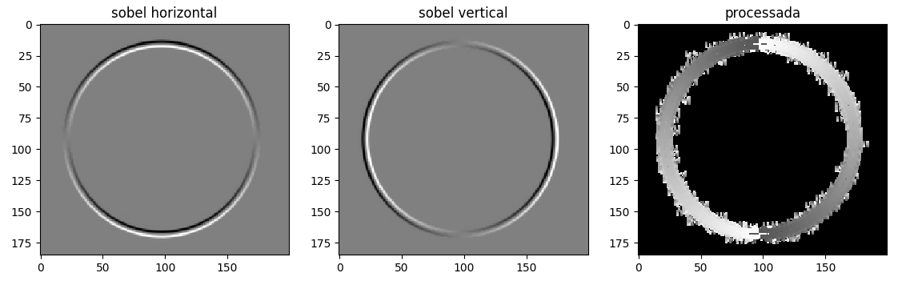
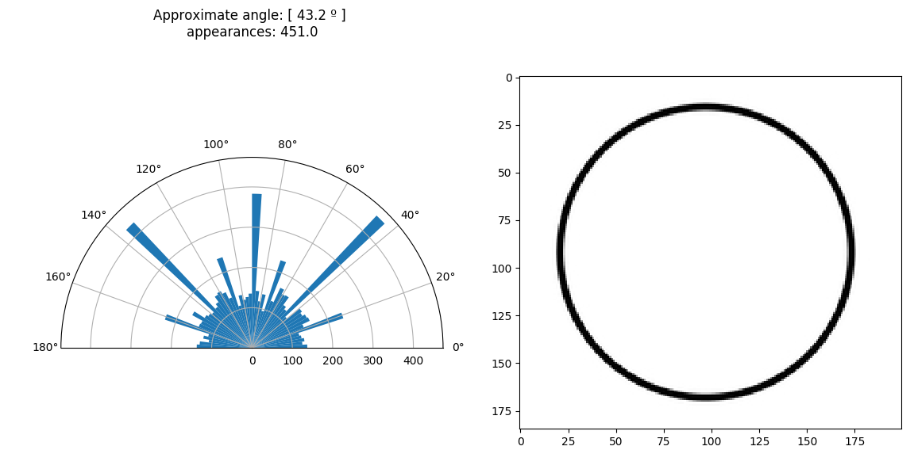

Meu primeiro detector de ângulos em imagens de drône de plantação usando conceito simples de filtros sobel

_____________________________________________________________________
# Detecção do angulo
Ao invés de fazer logo de início um detector de linhas e angulos deferentes em uma unica imagem ou usar metodos ja existentes como a TRANSFORMADA DE HOUGH, resolvi me exercitar e elaborar o mais MANUALMENTE possível, um detector para o ÂNGULO MAIS PREDOMINANTE em uma imagem com base nos principios do filtro sobel.

Na agricultura de precisão/digital análises como esta são cruciais para demarcar regiões e linhas para realização de outros procedimentos. Em geral a foto de um drone é extremamente grande, tornando inviável, dependendo do computador, um algorítmo que a analise por inteiro, principalmente se se tratar de uma rede neural (que pretendo implementar futuramente). Por tais motivos é interessante o desmembramento desta imagem em imagens menores, em pequenas regiões. partindo daí decidi elaborar este simples algoritmo.

# Filtro sobel e inclinação
Numa pesquisa rápida vemos que estes dois filtros simples, ao serem convoluídos com a imagem detectam curvas diferenciais que representam gradientes de alteração de estado do pixel. Tendo as diferenciais horizontal e vertical, podemos por pitágoras, obter a inclinação de uma linha da imagem.

# Código
Existem dois parametros basicos já preenchidos: Amostra, que define a quantidade de amostras usadas para analisar a frequencia dos angulos (amostras muito grandes resultam em intervalos muito pequenos deficultando a análise de frequencia, e muito baixos impede a análise de encontrar angulo com precisão); 
Caminho da imagem, onde deverá ser passado o caminho da imagem a ser analisada.

Os filtros foram definidos manualmente para forçar-me a entender os conceitos basicos de convolução e processamento de imagens com filtros.

Usando scipy realizei a convolução da imagem cinza com os filtros, um por vez:

A pŕimeira imagem é do filtro sobel horizontal e a segunda, do vertical, aplicados á imagem. A terceira imagem trata de, depois de multiplicar ambas pontualmente, processar a imagem resultante com o método arctan() que implementei.

# Processamento do gradiente
Para calcular o angulo usamos pitágoras, onde sin/cos = tan. se a intensidade horizontal H e a vertical V representam sin e cos respectivamente, então podemos dizer que, naquele local, o angulo é repesentado por Θ = arctan(H/V), e como arctan em +∞ e -∞ tende á pi/2, então Θ = arctan(H/V)*2/pi.
Após vários teste percebi que calculando o angulo ponto a ponto estariamos calculando cegamente, olhando pixel a pixel sem considerar os que estão ao redor, o que nos deixa num mar de ruído. a solução que eu encontrei por enquanto foi, não calcular para um pixel, mas para a média entre este pixel e todos os outros ao redor dele, desta forma estaremos enchergando mais amplamente. É o que esta sendo mostrado na terceira parte da imagem acima.

Se analisarmos todos os píxels da matriz processada, onde temos as intensidades de angulos detectadas da imagem, podemos plotar um histograma em forma polar, limitado entre 0º e 180º, que nos dirá qual angulo aparece mais vezes na imagem intera:

Então nós podemos notar neste caso, que enchergamos linhas quase diagonais, e o algorítmo também conseguil identificar este padrão, e que o angulo 65º aparece cerca de 7000 vezes.
# Outros exemplos:
_____________________________________________________________________

Observamos que a partir da imagem original extraímos seus gradientes e processamos obtendo o mapa de inclinações, e atravém de um histograma em formato de transferidor, observamos claramente o angulo mais frequente em toda a imagem escrito logo a cima do histograma.
_____________________________________________________________________

_____________________________________________________________________

É muito interessante reparar como se comporta o gradiente na imagem processada abaixo. COnseguimos observar como o sobel nos retorna o angulo, com as cores do circulo mudando do preto ao branco indicando uma mudança de 0 a pi.

Neste circulo podemos observar que, existem alguns angulos e eles são mostrados, mas eles ocorrem poucas vezes, cerca de 400 vezes, este pode ser um parametro para considerarmos como limite para considerar como angulos fortes o suficiente.
_____________________________________________________________________
